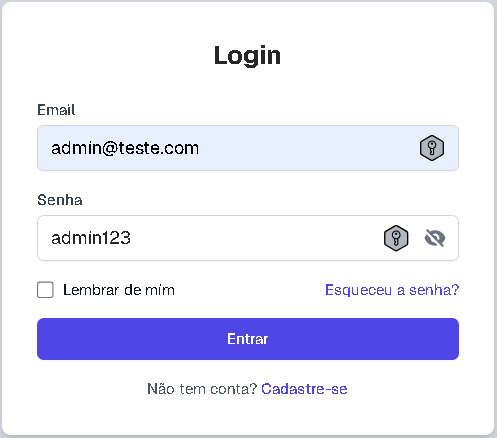

# 🔐 Tela de Login - React + Next.js + Tailwind

Uma tela de login simples e funcional, criada utilizando:

- ⚛️ **React + Next.js 14**
- 🎨 **TailwindCSS** para o design
- 🔐 **Autenticação** básica (sem backend por enquanto)
- 💡 Estrutura preparada para adicionar integração com Firebase, Auth0 ou outros sistemas de autenticação

---

## 🖼️ Preview



---

## 🚀 Tecnologias Utilizadas

- [Next.js](https://nextjs.org/) - Framework full-stack para React
- [React](https://reactjs.org/) - Biblioteca para interfaces dinâmicas
- [TailwindCSS](https://tailwindcss.com/) - Framework utilitário para design rápido e customizável
- [TypeScript](https://www.typescriptlang.org/) - Superset do JavaScript para um código mais seguro e escalável

---

## ⚙️ Como Rodar Localmente

Para rodar este projeto localmente, siga os passos abaixo:

```bash
# Clone o repositório
git clone https://github.com/SaunKiziN/Login-Screen-REACT.git

# Acesse a pasta do projeto
cd Login-Screen-REACT

# Instale as dependências
npm install

# Rode o projeto
npm run dev 

```

---

## 📁 Estrutura de Pastas

📁 app/
 ┣ 📁 login-screen/
   ┣ 📄 login.tsx            # Tela de login
 ┣ 📁 user-screen/
   ┣ 📄 page.tsx             # Página de usuário após login
 ┣ 📄 layout.tsx             # Layout geral da aplicação
 ┣ 📄 page.tsx               # Página inicial
📁 lib/
 ┣ 📁 Data-storage/
   ┣ 📄 page.tsx             # Gerenciamento de dados de armazenamento
 ┣ 📄 validation.tsx         # Validação de formulários e dados
📁 public/
📁 styles/

---

## 🧠 Autor
Feito com 💻 por SaunKiziN.

---

## 📜 Licença
Este projeto está licenciado sob a MIT License. Consulte o arquivo LICENSE para mais detalhes.
