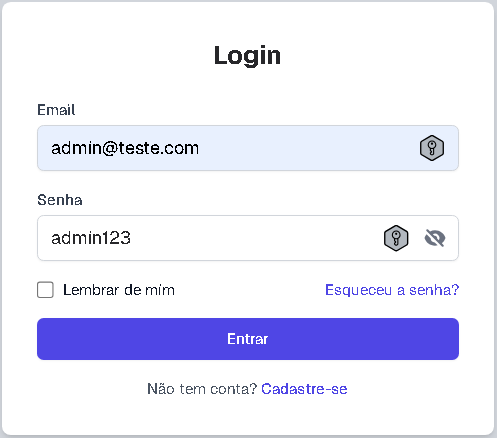

# 🔐 Login Screen — React UI

Interface de login desenvolvida com **React**, **Next.js** e **Tailwind CSS**, com foco em layout limpo, responsividade, validação visual e experiência de usuário.

> Este projeto é um protótipo front-end. Ele não possui autenticação real com banco de dados ou back-end.

---

## 🔗 Demo

Acesse o projeto online:

[login-screen-react-mauve.vercel.app](https://login-screen-react-mauve.vercel.app/)

---

## 🖼️ Preview



---

## Sobre o projeto

Este projeto foi criado para praticar a construção de uma tela de login moderna, simples e funcional.

O foco principal foi trabalhar:

* estrutura de interface;
* estilização com Tailwind CSS;
* componentização;
* responsividade;
* validação de campos;
* simulação de fluxo de login;
* organização de arquivos em um projeto Next.js.

---

## Funcionalidades

* Tela de login responsiva
* Campos de e-mail e senha
* Validação visual dos campos
* Botão para exibir/ocultar senha
* Opção “lembrar de mim”
* Simulação de acesso após login
* Página de usuário após autenticação simulada

---

## Credenciais de teste

Use as credenciais abaixo para testar a simulação de login:

```txt
E-mail: admin@teste.com
Senha: admin123
```

> Essas credenciais são apenas para demonstração. O projeto não utiliza banco de dados nem autenticação segura em ambiente de produção.

---

## Tecnologias utilizadas

* [Next.js](https://nextjs.org/) — Framework React para aplicações web
* [React](https://react.dev/) — Biblioteca para construção de interfaces
* [Tailwind CSS](https://tailwindcss.com/) — Framework utilitário para estilização
* [TypeScript](https://www.typescriptlang.org/) — Superset do JavaScript com tipagem estática

---

## Como rodar localmente

```bash
# Clone o repositório
git clone https://github.com/SaunKiziN/Login-Screen-REACT.git

# Acesse a pasta do projeto
cd Login-Screen-REACT

# Instale as dependências
npm install

# Rode o projeto
npm run dev
```

Depois, acesse:

```txt
http://localhost:3000
```

---

## Estrutura de pastas

```txt
app/
├── login-screen/
│   └── login.tsx
├── user-screen/
│   └── page.tsx
├── layout.tsx
└── page.tsx

lib/
├── Data-storage/
│   └── page.tsx
└── validation.tsx

public/
└── preview.png

styles/
```

---

## Limitações

Este projeto ainda não possui:

* cadastro real de usuários;
* autenticação com back-end;
* banco de dados;
* recuperação de senha funcional;
* proteção real de rotas privadas;
* integração com serviços como Firebase, Supabase ou Auth0.

---

## Próximos passos

Possíveis melhorias futuras:

* adicionar cadastro de usuários;
* integrar autenticação real com Firebase, Supabase ou Auth0;
* criar proteção de rotas;
* melhorar mensagens de erro;
* adicionar testes;
* refatorar componentes;
* melhorar acessibilidade.

---

## Autor

Feito por **Samuel Berretta / SaunKiziN**

* GitHub: [github.com/SaunKiziN](https://github.com/SaunKiziN)
* LinkedIn: [linkedin.com/in/samuel-berretta](https://www.linkedin.com/in/samuel-berretta)
* E-mail: [samuberretta.biz@gmail.com](mailto:samuberretta.biz@gmail.com)

---

## Licença

Este projeto está licenciado sob a licença MIT.
